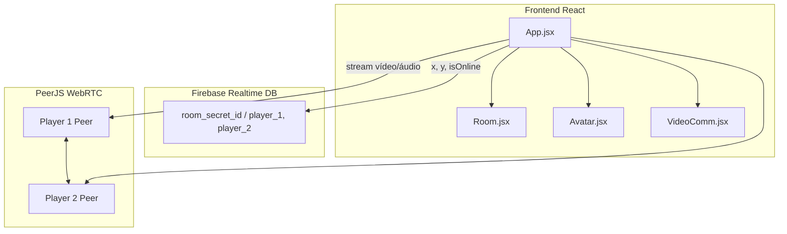

# Plano: Our Isometric World - MVP 24h

## Visão da arquitetura




---

## Fase 1: Inicialização do projeto

- **Vite + React:** `npm create vite@latest . -- --template react` (ou já existente).
- **Tailwind CSS:** Instalar e configurar (`tailwindcss`, `postcss`, `autoprefixer`) com `content: ["./index.html", "./src/**/*.{js,ts,jsx,tsx}"]`.
- **Dependências:** `firebase` (Realtime Database), `peerjs` (WebRTC). Sem servidor PeerJS próprio: usar o servidor público do PeerJS ou documentar uso de um cloud/self-hosted.
- **Variáveis de ambiente:** `.env` com `VITE_FIREBASE_*` (apiKey, authDomain, databaseURL, projectId, etc.) e opcionalmente `VITE_PEERJS_HOST` / `port` se for customizado. Não commitar chaves reais; usar `.env.example`.

Estrutura de pastas sugerida:

```
src/
  App.jsx
  main.jsx
  index.css
  components/
    Room.jsx
    Avatar.jsx
    VideoComm.jsx
  lib/
    firebase.js
    peer.js (opcional: factory/helpers do Peer)
```

---

## Fase 2: Firebase e modelo de dados

- **Arquivo** `src/lib/firebase.js`: inicializar Firebase App e `getDatabase()`. Exportar `db` e funções auxiliares para leitura/escrita da sala.
- **Regras de segurança:** Em produção, restringir por `roomId` e validar estrutura (`player_1`, `player_2` com `x`, `y`, `isOnline`). Para MVP, pode-se usar regras temporárias (ex.: apenas autenticados ou teste).
- **Identificação da sala e dos jogadores:**
  - **Room ID:** Gerado no primeiro acesso (ex.: `crypto.randomUUID()` ou slug curto) e colocado na URL (ex.: `/?room=abc123`). Quem abre primeiro é “dono” da sala; o link é compartilhado com o parceiro.
  - **Quem é player_1 vs player_2:** Por exemplo: primeiro a conectar escreve em `player_1`; segundo, em `player_2`. Usar presença (ex.: `isOnline` true ao entrar, false ao sair/onDisconnect) para evitar conflito.

Estrutura no Realtime DB (conforme PRD):

```json
{
  "room_secret_id_123": {
    "player_1": { "x": 100, "y": 150, "isOnline": true },
    "player_2": { "x": 300, "y": 200, "isOnline": true }
  }
}
```

- **Throttle (R1):** Atualizar Firebase no máximo a cada ~50ms (timestamp da última escrita; ignorar teclas se ainda não passou 50ms).

---

## Fase 3: Componentes principais

### 3.1 `App.jsx`

- Ler `roomId` da URL (ex.: `useSearchParams()` do React Router ou `window.location.search`). Se não houver, gerar um e redirecionar para `/?room=<id>` (opcional: mostrar “Copiar link” para compartilhar).
- Definir estado global (ou contexto simples) para:
  - `myPosition`: `{ x, y }` (local).
  - `partnerPosition`: `{ x, y }` (remoto).
  - `iamPlayer1`: boolean (quem abriu a sala é player_1).
  - `partnerOnline`: boolean (derivado de `isOnline` do outro jogador).
- **Firebase:** Um `useEffect` que:
  - Ao montar: se for player_1, inicializa/garante `player_1`; se player_2, `player_2`. Usar `onDisconnect()` para marcar `isOnline: false`.
  - Escuta `onValue(ref(roomId))` e atualiza `partnerPosition` e `partnerOnline`.
- Outro `useEffect` para teclado (WASD ou setas): atualiza `myPosition` localmente com limites (R1) e, com throttle de 50ms, escreve no Firebase no nó do jogador atual.
- **Música (R4):** Estado `musicPlaying`; `<audio loop src="...">` + botão flutuante “Play/Pause”. No primeiro clique do usuário, chamar `audio.play()` para respeitar políticas de autoplay.
- Renderizar: `Room` (com Avatares dentro), `VideoComm`, botão de música.

### 3.2 `Room.jsx`

- **Isometria (CSS):** Container com:
  - `transform: rotateX(60deg) rotateZ(45deg);` (e eventualmente `transform-style: preserve-3d` no pai se necessário).
  - Dimensões fixas da “sala” (ex.: 400x400 px ou 100% de um wrapper) para definir os limites de X e Y usados em R1.
- Receber por props: posições dos dois jogadores, qual é o local e qual é o remoto.
- Renderizar dois `<Avatar>` com as posições e flags `isLocal` / `isPartner`.

### 3.3 `Avatar.jsx`

- **Props:** `x`, `y`, `userImage` (URL ou stream para foto do usuário; pode ser thumbnail do vídeo ou placeholder), `isLocal`.
- Posicionamento: `position: absolute; left: x; top: y;` (em px ou unidades consistentes com a sala).
- **Contra-rotação (PRD):** `transform: rotateZ(-45deg) rotateX(-60deg);` para o avatar ficar “em pé” no plano isométrico.
- **Z-index (R2):** Calcular dinamicamente: avatar com **maior Y** (mais “atrás” na sala) recebe **menor** `z-index`; o com menor Y fica na frente. Ex.: `zIndex: partnerY > myY ? 1 : 2` para um e o inverso para o outro.

### 3.4 `VideoComm.jsx`

- **Permissões:** Usar `navigator.mediaDevices.getUserMedia({ video: true, audio: true })` (tratar erros e estado “sem permissão”).
- **PeerJS:**
  - Player 1: cria `new Peer()` (ou com opções customizadas); obtém `peer.id` e exibe/compartilha (pode ser enviado via Firebase em `room_secret_id` em um campo `peerId` ou mostrado na UI para o parceiro digitar).
  - Player 2: cria `new Peer()` e chama `peer.call(peerIdDoPlayer1, localStream)`.
  - Player 1: em `peer.on('call', (call) => call.answer(localStream))`.
  - Ao receber o stream remoto, exibir em um `<video ref={remoteVideoRef} autoPlay playsInline />`; vídeo local em outro `<video muted autoPlay playsInline />` (R3: local muted para evitar feedback).
- **Layout (R3):** Vídeos no canto inferior direito, estilo PiP (position fixed, pequenos). Local mutado; remoto com áudio ligado.

---

## Fase 4: Requisitos funcionais (checklist)


| ID     | Requisito                                                                                                           | Onde implementar                                                       |
| ------ | ------------------------------------------------------------------------------------------------------------------- | ---------------------------------------------------------------------- |
| **R1** | Limites da sala: `if (x < 0) x = 0`, idem para max e para `y`. Throttle 50ms nas escritas no Firebase.              | `App.jsx` (handler de teclado + função de escrita)                     |
| **R2** | Z-index dinâmico: maior Y → menor z-index.                                                                          | `Avatar.jsx` ou `Room.jsx` (passar z-index calculado para cada Avatar) |
| **R3** | Player 1 gera Peer ID; Player 2 conecta a esse ID. Vídeos no canto inferior direito; local muted, remoto com áudio. | `VideoComm.jsx` + possível campo no Firebase para trocar `peerId`      |
| **R4** | `<audio>` em loop + botão flutuante Play/Pause para desbloquear autoplay.                                           | `App.jsx`                                                              |


---

## Fase 5: Fluxo de entrada na sala e Peer ID

- **Opção A (simples):** Player 1, ao carregar a sala, gera o Peer e grava no Firebase `rooms/<roomId>/peerIdHost: "<peer-id>"`. Player 2, ao carregar, lê esse `peerIdHost` e inicia a chamada. Assim não é preciso colar ID manualmente.
- **Opção B:** Mostrar o Peer ID na tela para Player 2 digitar (menos elegante, mas sem escrever no Firebase).

Recomendação: Opção A, com cuidado para não sobrescrever se já existir um host (só player_1 escreve `peerIdHost`).

---

## Ordem sugerida de implementação

1. Scaffold do projeto (Vite, React, Tailwind, Firebase, PeerJS).
2. `firebase.js` + leitura/escrita da sala + throttle e limites (R1) em `App.jsx`.
3. `Room.jsx` com transform isométrico + `Avatar.jsx` com contra-transform e z-index (R2).
4. Integrar teclado em `App.jsx` e ligar posições aos avatares.
5. `VideoComm.jsx`: mídia, PeerJS, UI PiP (R3) e troca de Peer ID via Firebase.
6. Áudio de fundo + botão Play/Pause (R4).
7. Ajustes de UX: indicador “parceiro online”, link “Copiar sala”, tratamento de desconexão.

---

## Riscos e notas

- **PeerJS em produção:** O servidor público pode ter limites; para uso real, considerar PeerJS Server próprio ou serviço cloud. Documentar no README.
- **Firebase quota:** Throttle de 50ms e escrita apenas quando a posição mudar reduzem escritas. Regras de segurança devem limitar taxa por usuário se necessário.
- **Mobile:** Teclado físico não existe; considerar botões on-screen ou gestos para movimento em uma iteração futura (fora do escopo do MVP 24h se o PRD for estrito).
- **Fallback de mídia:** Se o usuário negar câmera/microfone, o app deve continuar (só movimento/isometria); `VideoComm` pode mostrar “Câmera desativada” e esconder o PiP.

---

## Entregáveis

- Código fonte em `src/` com os quatro componentes e libs descritos.
- `.env.example` com as chaves necessárias (sem valores reais).
- README com: como rodar (`npm install`, `npm run dev`), como configurar Firebase (criar projeto, ativar Realtime Database, colar config no `.env`) e como obter/compartilhar o link da sala.

